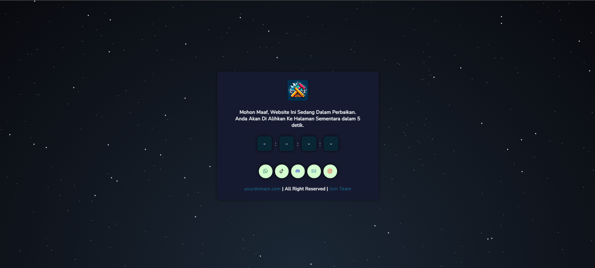

<h2>Simple Under Construction Page</h2>

<h4>Preview Halaman / Website :</h4>

Link Preview Template : <a href="https://simple-under-construction-page.vercel.app" target="_blank">Klik Disini ( Vercel Server )</a>

<h4>Bahasa Pemrograman Yang Digunakan :</h4>
<ul>
<li>HTML</li>
<li>CSS</li>
<li>JavaScript</li>
</ul>

<h4>Cara Menggunakan Template Ini :</h4>
<ol>
<li>Ubah Dan Sesuaikan File Javascript Pada Folder JS ( Redirect & Script.js )</li>
<li>File redirect.js Berfungsi Untuk Mengatur Timer Hitung Mundur Dan Link Tujuan Halaman Setelah Hitungan Mundur Selesai</li>
<li>FIle script.js Berfungsi Untuk Mengatur Waktu Mundur Sampai Halaman Aslinya Selesai / Rilis</li>
</ol>

Note : Jangan Lupa Hapus Komentar Pada File script.js Dan redirect.js

Powered By Farsyafad Tech  |  Jangan Lupa Kasih Star Yaa
